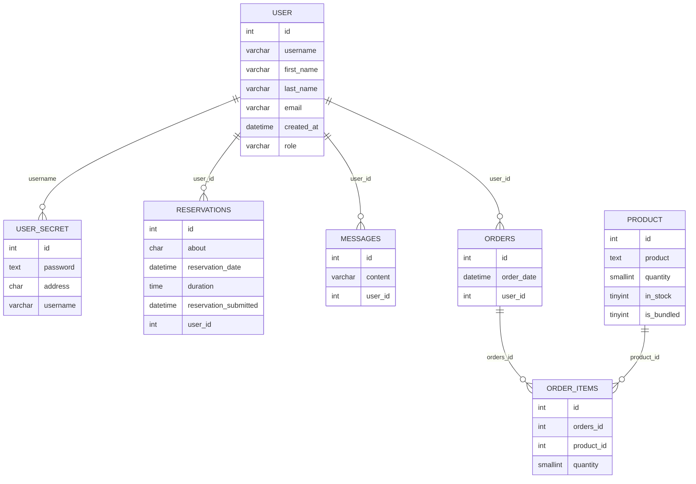

## Adatbázismodell (torma)

Az API a `torma` adatbázist használja. Az alábbi egyszerű diagram a főbb táblák és kapcsolatok áttekintését adja.

Részletes SQL definíciók a `database/torma.sql` fájlban találhatók.

